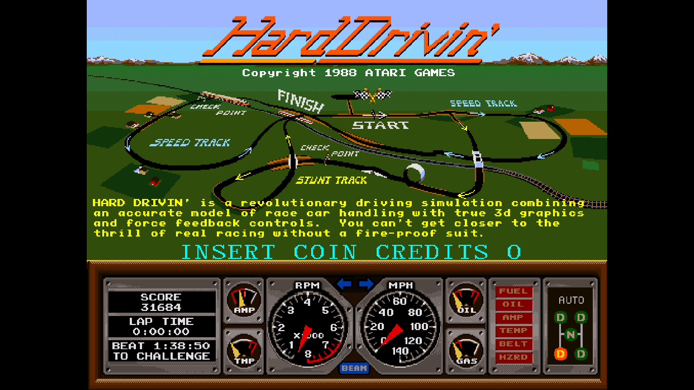
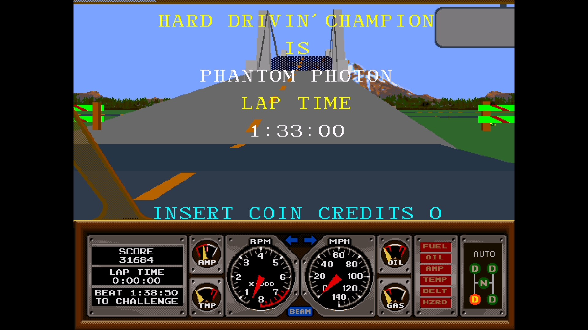
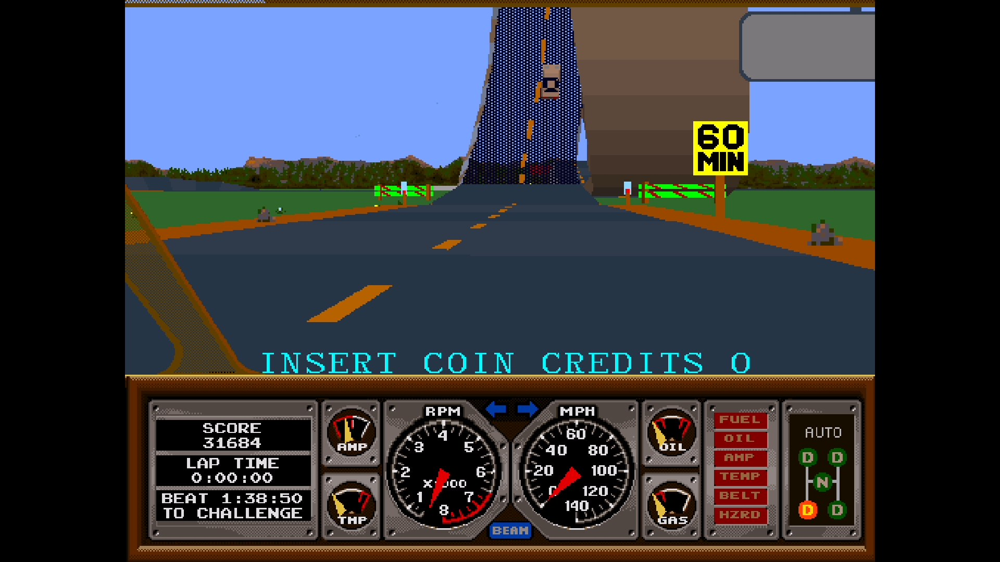

# Hard Drivin’ for MiSTer

FPGA implementation of Atari’s Hard Drivin’ arcade hardware for the
DE10-Nano/MiSTer. This release supports **Cockpit, revision 7** and runs the
original 68010, TMS34010, ADSP-2100, 68000 and TMS32010 programs in FPGA logic.

## Screenshots







## Features

- 68010 main processor, TMS34010 graphics and math processors, and ADSP-2100 geometry processor.
- Polygon road and scenery rendering with the cockpit dashboard.
- Driver sound board with 68000, TMS32010 and sample playback.
- Analog steering, gamepad pedals, wheel mode, and sequential or H-pattern gear selection.
- Persistent game settings and calibration through MiSTer NVRAM.
- MiSTer video output with original 4:3 and raw-pixel aspect options.

## Installation and ROM

Release files are in `releases/`:

| File | SHA-1 |
| --- | --- |
| `HardDrivin_cockpit.rbf` | `82190fe8a9ad72c8a77bfb13c784f16e72bc65c7` |
| `Hard Drivin' (Cockpit, rev 7).mra` | `8ece851e0b6af11f19e549c5cef8c0165ffae24f` |

Copy the RBF to MiSTer’s `_Arcade/cores` directory and the MRA to `_Arcade`.
Place the unmodified MAME **`harddriv.zip`** ROM set in a MiSTer arcade ROM
search directory. Game ROM archives are not included. SHA-256 hashes are also
provided in [`releases/SHA256SUMS`](releases/SHA256SUMS).

Uses stock MiSTer Main. Game settings are saved in MiSTer NVRAM.

Cabinet force feedback is not provided.

## Build and test

The Quartus project targets Quartus Lite 24.1. Required HDL dependencies are
included; no submodule checkout is needed:

```sh
make prepare ROM=path/to/harddriv.zip
make build
make check
make test
```

The preparation step extracts and checks the original cockpit power-up RAM
images. Generated files stay outside Git. Install `output_files/HardDrivin.rbf`
as `HardDrivin_cockpit.rbf` to use it with the supplied MRA.

Checks require Python 3.10+ and Tcl. The ROM-free memory regressions require
Verilator 5 and a C++ compiler.

## Source and licensing

Core development: [Fulviuus](https://github.com/Fulviuus).

Project integration is distributed under **GPL-3.0-or-later**. This repository
includes third-party FPGA components under their original licenses and
copyright notices:

- MiSTer framework and SDRAM controller: GPL-2.0 / GPL-2.0-or-later, as marked in each file.
- TMS34010: MIT.
- TG68K: LGPL-3.0-or-later.
- FX68K: GPL-3.0.
- IKA32010: BSD-2-Clause.

See [`LICENSE`](LICENSE), [`NOTICE`](NOTICE), and the component license files
for attribution and source revisions. MAME was used as a behavioral reference
during development.
